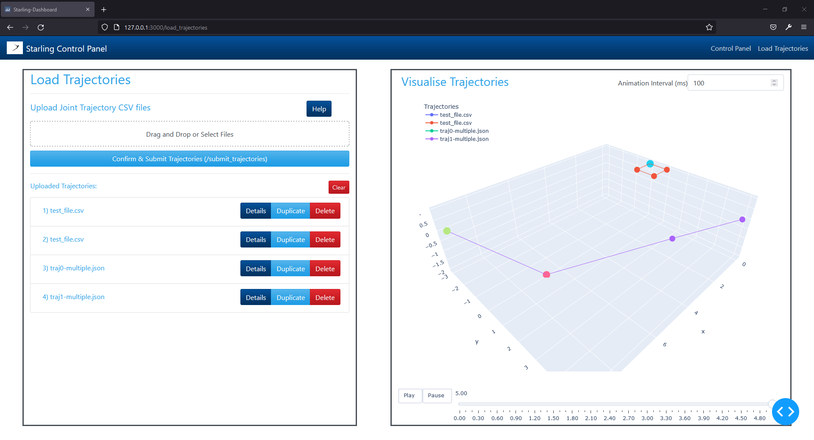

# Starling Control Panel (ROS2 + Dashly)

This project serves as a mission control and configuration dashboard for the [Starling Project](https://github.com/UoBFlightLab/ProjectStarling) to replace the existing quick dashboard written in pure javascript.

The purpose of this dashboard is to provide a clearer, friendlier and more extensible dashboard that can be used within the flight arena at the Bristol Robotics Laboratory for conducting single and multi-drone experiments and operations.

This dashboard is written in Python and interfaces simultaneously with [Dash](https://dash.plotly.com/) and ROS2 Foxy. This also serves as an example project for combining Dash and ROS2 into a single project (following on from [flask_rclpy](https://github.com/codebot/flask_rclpy)).


## Setup and Installation

### Plain Installation

After install ROS2 Foxy, install the dash dependencies through pip

```
pip3 install dash dash-bootstrap-components gunicorn pandas
```

Once installed, clone this repository into the `src` folder of your `ros_ws` and build using colcon. (Make sure you have sourced ros2)

```
cd ros_ws/src
git clone https://github.com/mhl787156/starling_ui_dashly.git
cd ../ # Back into ros_ws
colcon build --packages-select starling_ui_dashly
```

Once build, the main node can be launched as follows

```
ros2 launch starling_ui_dashly dashboard_gunicorn.launxch.xml
```

which will run a user facing server on https://0.0.0.0:3000

### Docker

The project can also be run using a dockerfile, either build the local file after cloning as follows

```
docker build -t starling_ui_dashly:latest .
docker run --it -rm --network=host starling_ui_dashly:latest
```

Or use the built version on docker hub
```
docker run --it -rm --network=host mickeyli789/starling_ui_dashly:latest
```

## Usage

### Mission Control Screen (`/`)


#### Mission Control

* Start Mission: Pressing the button will send a single `std_msgs/String` on the `/mission_start` topic.
* Cancel Mission: Pressing the button will send a single `std_msgs/String` on the `/mission_abort` topic. This topic is intended as a soft, controlled stop of the mission (e.g. hover and land, or hover, return to home then land) as determined by the connected controller

The system status will query for currently broadcasting vehicles (`/vehicle_xxx/...`)

#### Emergency Stop

The estop functions like a hardware estop. When engaged it will continuously send `std_msgs/String` on the `/emergency_stop` topic at 10hz. Pressing the ESTOP button will toggle engaged/disengaged.

Support for the `/emergency_stop` topic should be built into all running controllers

### Load Trajectory screen (`/load_trajectory`)



#### Loading a trajectory

One or more trajectory files can be uploaded using this page to be submitted to Starling to be run on one or more physical drones.
These can be uploaded by either clicking and selecting in the window, or by dragging and dropping files into the area.
Loaded trajectories will show in the list below the uploading box. There, the trajectories can be inspected and individually removed.
The trajectories can also be inspected in 3D on the right hand screen to ensure the correct trajectories have been loaded.


#### Single Trajectory Files

The format for these will be the following for all file formats.
The first row will be a header row where the first column is the `time_from_start` and the remaining columns are the target x, y and z position:


| Time      | x | y | z |
| ----------- | ----------- | ----------- | ----------- |
| 0.0      | 0.0      | 5.0 | 0.0 |
| 1.5   | 2.0        | 3.0 | -1.0 |
| 4.5      | 6.74      | 0.02 | -2.0 |

##### Supported File Formats:
These must be parseable by the `pandas` python utility

* .csv
* .xls

#### Multiple Trajectory Files

The utility will expect a JSON file (ending in `.json`) of the following format

```json
{
    "1": {
        "columns": ["time", "x", "y", "z"],
        "data": [
            [0.0, 0.0, 5.0, 0.0],
            [1.5, 2.0, 3.0, -1.0],
            [4.5, 6.75, 0.02, -2.0]
        ]
    },
    "2": {
        "columns": ["time", "x", "y", "z"],
        "data: [...]
    }
}
```

The `data` field of each trajectory block matches that of the single trajectory file. In each row, the first element is the `time_from_start`, and the remaining are the target x, y, and z position.

#### Submitting the Trajectory

Once happy with the loaded trajectories, pressing the `submit` button will send **all loaded trajectories** over the `\submit_trajectories` service to the Allocator node to be executed by the vehicle.
The trajectories will be converted into [JointTrajectory.msg](https://docs.ros2.org/foxy/api/trajectory_msgs/msg/JointTrajectory.html) and [JointTrajectoryPoint.msg](https://docs.ros2.org/foxy/api/trajectory_msgs/msg/JointTrajectoryPoint.html).

## Implmenetation Details

Both Dash and ROS2 follow their own parallelism paradigms which butt heads in some ways. Currently, the server will spin up ROS2 in its own thread with Dash running in the primary thread.

Once the ROS2 node instance has been set spinning, the instance is then passed to the dash dashboard handler as a server side variable. When the dashboard needs to interface with ROS2, node instance methods can be called.

This somewhat breaks the 'stateless' property of Dash, but as this is being used in a limited capacity in a controlled environment with limited people using the dashboard at any one time (and not on the internet), we deemed that it was a good enough solution to the problem. It is safe enough to have a single version of the node running on the server machine with usually one, or maybe two users using the dashboard at any one time.

Ideally we would have used the [ros2-web-bridge](https://github.com/RobotWebTools/ros2-web-bridge) with React but this would have required a large learning curve for React which we wanted to avoid.
